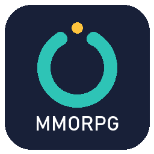

# Open MMORPG: A free, community-maintained Unity MMO framework



**Open MMORPG** is an opinonated community-maintained distribution of MMORPG Kit. After the original asset was removed from the Unity Asset Store, Ittipon Teerapruettikulchai (insthync) open sourced his work. **Open MMORPG** exists to preserve, improve, and evolve this foundation, and will continue to pull improvements and fixes from his core repos into this distribution where it makes sense.

### The Three S's Guiding Principle

Every change, fix, or removal in Open MMORPG is evaluated against these core goals:

- **Scalability**: Can the system handle hundreds or thousands of concurrent players?
- **Stability**: Does it reduce bugs, crashes, edge cases, and unexpected behavior?
- **Security**: Does it harden the codebase against exploits, cheating, and data leaks?

**No other feature requests or enhancements** are considered unless they demonstrably advance one or more of these three goals. In fact, non-essential or problematic features may be **removed** or **moved to addons** if doing so improves any of the three S's.

## What's Included

### Addon Manager
Addon Manager is an in-editor interface that allows the community and team to modularize functionality.

- Former "core" features that were too niche, experimental, or optional can be extracted into addons.
- Addons are discovered, installed, and updated directly inside Unity, similar to a private Unity Package Manager.
- This keeps the **core distribution lean**, focused, and easier to maintain long-term.

### Login Manager
Login Manager is a clean separation of login/authentication logic from the central game servers.

- Improved scalability: Concurrent login limit prevents the login server from being overwhelmed during spikes. The dedicated login server + cluster client allows independent scaling of auth traffic away from game logic.

### Sharded DatabaseNetworkManager
Added lanes, queueing, deferred/throttled saves, and a working in-memory cache.

- Improved scalability: Vastly improved horizontal/concurrency scaling with sharded lanes + locks + ConcurrentDictionary support higher player counts and multi-threaded server ops without contention or overload. Limits (e.g., max saves/proceed) provide predictable load.

### Cell-Based Position Quantization
Cell-based position quantization dramatically improves network efficiency for entity movement.

- Improved scalability: Lower network traffic supports more concurrent players, higher update rates, and denser entity populations.
- LOD based compression: Close entities (the ones the player actually interacts with) keep high-precision modes, while distant entities (the majority in large MMO worlds) send position data in as little as 4 bytes.

**World Size Assumptions:** The system uses a fixed square grid centered at the world origin. The maximum supported world size is determined by configurable CellSize. Positions outside the grid are clamped to edge cells.

### Jobs Movement Pipeline
All entity movement data processing converted from monothreaded per-entity updates to Unity Jobs + Burst parallel processing.

- Improved scalability: Combined with vector quantization and packed serialization, network payloads shrink dramatically, improving both server tick rate and bandwidth usage.

## Quick Start / Installation Wizard

Open MMORPG targets **Unity 6000.3** or newer and renders with the **Universal Render Pipeline**. The installer adds URP for you, so a Built-in Render Pipeline project works too, but the kit's graphic settings are URP specific.

1. **Install the package from a git URL**

Open Window → **Package Manager** and click **Add package from git URL**
```
https://github.com/open-mmorpg/open-mmorpg-installer.git
```

2. **Run the Wizard to import Settings and the Latest Release**

A setup wizard will appear after the package is installed. If the Wizard does not appear or is inadvertently closed, you can reopen it at Open MMORPG → Install → **Show Setup Wizard**

Click **Import Settings** to install base project settings. The following settings will be overwritten by this process:

 - ProjectSettings/DynamicsManager.asset
 - ProjectSettings/InputManager.asset
 - ProjectSettings/ProjectSettings.asset
 - ProjectSettings/QualitySettings.asset
 - ProjectSettings/TagManager.asset
 - ProjectSettings/TimeManager.asset

Click **Import Open MMORPG** to install the latest release into `Assets/OpenMMORPG`.

After installation, browse available addons via the Addon Manager window (Open MMORPG → Develop → **Addon Manager**). Have fun building!

If you imported the kit on its own, without the installer package, apply the same base settings from Open MMORPG → Install → **Import Project Settings**. It lists exactly which files it replaces before doing anything.

## Yo! Where's the demo?

A demo is not bundled with this release yet. For a developer-focused demo with content, check the Addon Manager for TinyEpicDemo.

## Updating Open MMORPG

To update, update the package in the Package Manager and re-run the Wizard.

## Developing Open MMORPG

The kit lives directly in your project's `Assets` folder, so you can work on it in place. Delete the imported `Assets/OpenMMORPG` directory and clone this repository in its place:

```sh
git clone https://github.com/open-mmorpg/OpenMMORPG.git Assets/OpenMMORPG
```

See [CONTRIBUTING.md](CONTRIBUTING.md) for the branch model and how the kit is assembled from its source repositories.

## License

Open MMORPG is released under the [MIT License](LICENSE). Third-party components under `ThirdParty` carry their own licenses in their respective folders.

## Thanks

Huge thanks to Ittipon Teerapruettikulchai for open sourcing the original kit, and to the MmoKitCE team at [Denarii Games](https://github.com/denariigames) for preserving and hardening it, and for blessing this continuation. Special thanks to the entire community of former customers and new developers who continue to keep this ecosystem alive.
